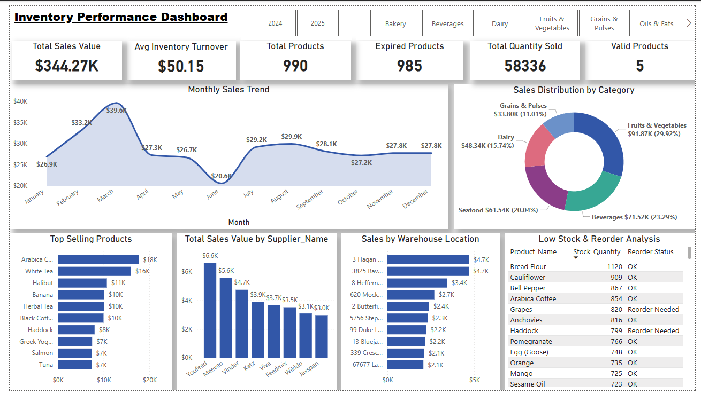

# inventory-performance-dashboard
Power BI Inventory Dashboard analyzing sales, stock levels, supplier &amp; warehouse performance with DAX-based KPIs and interactive visuals.
# 📊 Inventory Performance Dashboard

## 📌 Overview
This project is an interactive **Inventory Performance Dashboard** built using **Power BI**.  
It provides insights into sales performance, inventory status, product availability, and supply chain efficiency.

---

## 🚀 Key Features
- 📈 Monthly Sales Trend Analysis  
- 🛒 Total Sales Value & Quantity Sold  
- 📦 Inventory Turnover Tracking  
- ⚠️ Low Stock & Reorder Analysis  
- 🏷️ Category-wise Sales Distribution  
- 🏭 Warehouse Performance Analysis  
- 🤝 Supplier Performance Insights  

---

## 📊 KPIs Included
- Total Sales Value  
- Average Inventory Turnover  
- Total Quantity Sold  
- Total Products  
- Expired Products  
- Valid Products  

---

## 🛠️ Tools & Technologies
- Power BI  
- DAX (Data Analysis Expressions)  
- Power Query  
- Microsoft Excel  

---

## 📂 Dataset
The dataset includes:
- Product details  
- Sales data  
- Inventory levels  
- Supplier & warehouse information  

---

## 📸 Dashboard Preview

## 💡 Key Insights
- Identified top-selling products and categories  
- Detected low stock items requiring immediate reorder  
- Analyzed supplier and warehouse performance  
- Monitored expired vs valid inventory  

---

## 📎 How to Use
1. Download the `.pbix` file  
2. Open in Power BI Desktop  
3. Explore interactive visuals using filters and slicers  

---

## 🎯 Project Purpose
This project demonstrates skills in:
- Data Cleaning & Transformation  
- Data Modeling  
- DAX Calculations  
- Business Intelligence & Visualization  
